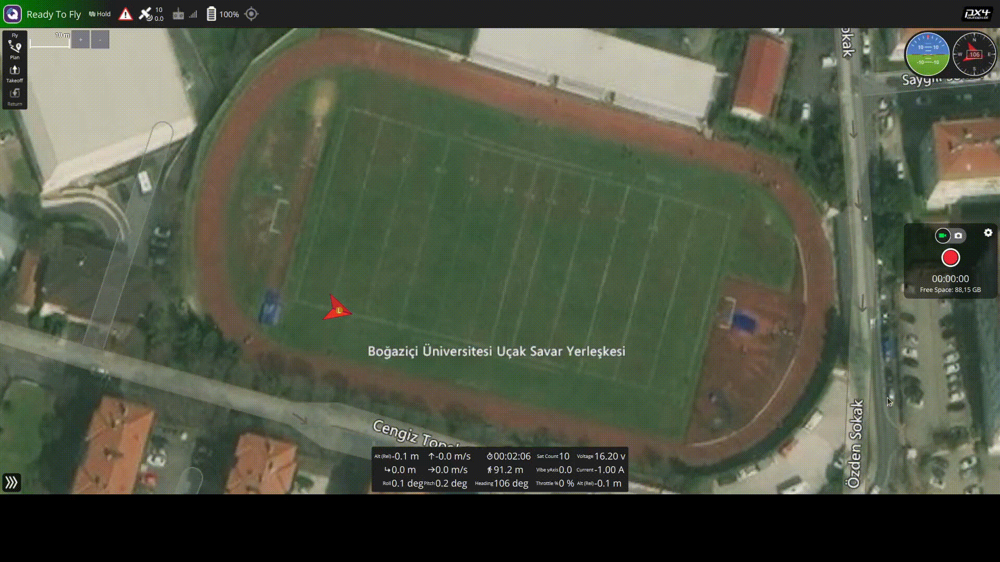
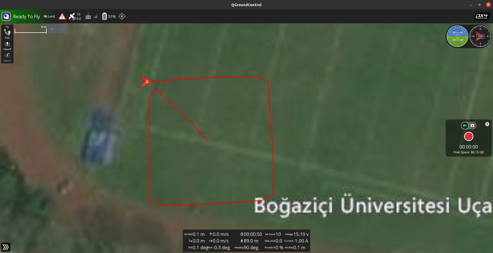

# ROS-Gorev4

## Özet

Bu görevde mavros üzerinden position setpoint göndererek drone’ın kare şeklindeki bir yolu takip etmesini sağlamanız istenmektedir.

## Açıklama

Position setpoint nedir: Mavros üzerinden drone’u hareket ettirmek için birden fazla yöntem vardır. Bu yöntemler; position setpoint gönderme, velocity setpoint gönderme, mission setpoint gönderme veyahut angular velocity setpoint göndermedir. Position setpoint göndererek drone’u istediğimiz belli bir position’a hareket ettirebilliriz. 

Position gönderme local position veyahut global position göndererek gerçekleştirilebilir. Global position göndermede gönderdiğimiz position’ı GPS koordinatı olarak göndeririz. Local position göndermede ise gönderdiğimiz position’ı drone’un kalkış noktasını(home noktası olarak da bilinir) koordinat sistemimizin origini olarak kabul edip bu koordinat sistemi üzerindeki bir noktayı(birimler metre cinsindendir) position olarak göndeririz. Bu görev için local position göndermek daha avantajlıdır. 

Bu görevde drone’ın kalkış noktası karenin merkezi olacak şekilde 10x10 metrelik kare şeklindeki bir yolu drone’un takip etmesini sağlamalıyız. 

İpuçları: 

→ Ros üzerinden veri publish veya subsribe edilirken veriler farklı veri türleri üzerinden aktarılabilir. Mavros’da bir topiği kullanırken hangi veri tipi ile işlem yapmamız gerektiğini mavros’un sitesinden( [http://wiki.ros.org/mavros](http://wiki.ros.org/mavros)) bakarak öğrenebiliriz. Bu veri tipini ayrıca include etmemiz gerekmektedir. 

Örnek: Velocity setpoint göndermek için gereken veri tipine baktığımızda mavros’un sitesinde setpoint velocity topiğinin yanında [geometry_msgs/Twist](http://docs.ros.org/en/api/geometry_msgs/html/msg/Twist.html) veri tipinin linkinin verildiğini görürüz. Yani bu demek oluyor ki velocity setpoint göndermek istiyorsak çektiğimiz veriyi “geometry_msgs::Twist” veri tipini kullanarak çekmeliyiz. Ayrıca kodumuzda “<geometry_msgs/Twist.h>” header’ını da include etmeliyiz.

→ Mavros’da position gönderirken gönderdiğimiz position’a varıp varmadığımızı mavros fark edemez. Bizim bunu ayrıca kontrol etmemiz ve eğer bir position’a vardıysak bir sonraki position’a doğru hareket ettirmek için komut vermemiz gerekir. Bir position’a varıp varmadığımızı bu position’la aramızdaki uzaklığın belli bir mesafenin(threshold) altında olup olmadığına bakarak kontrol edebiliriz. Bunu şu şekil bir pseudocode ile gerçekleştirebiliriz: 

```c
bool setpointReached(pose) {
	return distance(pose, currentPose) < THRESHOLD; 
}
```

Burda threshold’u 0.5 metre seçebilirsiniz. Uzaklık hesaplama fonksiyonu olarak da euclidean uzaklık hesaplama yöntemini kullanabilirsiniz.

## Örnek

Görevi tamamladıktan sonra gazebo simülasyon evrenini px4 ile çalıştırıp görev dosyamızı ros ile çalıştırmamız gerekiyor. 

Sıra ile çalıştırılması gereken komutlar: 

→ Gazeboyu PX4 ile çalıştırmak için PX4’ün olduğu klasörde:  make px4_sitl gazebo

→ Mavros topiclerini ve node’larını çalıştırmak için catkin_ws’in olduğu klasörde: roslaunch offboard_tutorial px4_simulation.launch

→ Görev dosyamızı çalıştırmak için catkin_ws’in olduğu klasörde: rosrun <dosyanızın-bulunduğu-package-ismi> <dosyanızın-ismi>


Kodu çalıştırdıktan sonra QGround üzerinden drone’u offboard mode’a almalı ve sonrasında arm’lamalıyız. 



Görevin çalıştırılması sonucu QGround üzerinde örnek bir patika: 


